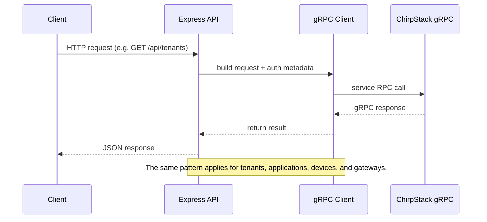

# Sequence Diagram  

This sequence diagram illustrates the flow of a typical request from a client (such as a web frontend) through the Express.js API layer, into the ChirpStack gRPC client, and finally to the ChirpStack server.  

